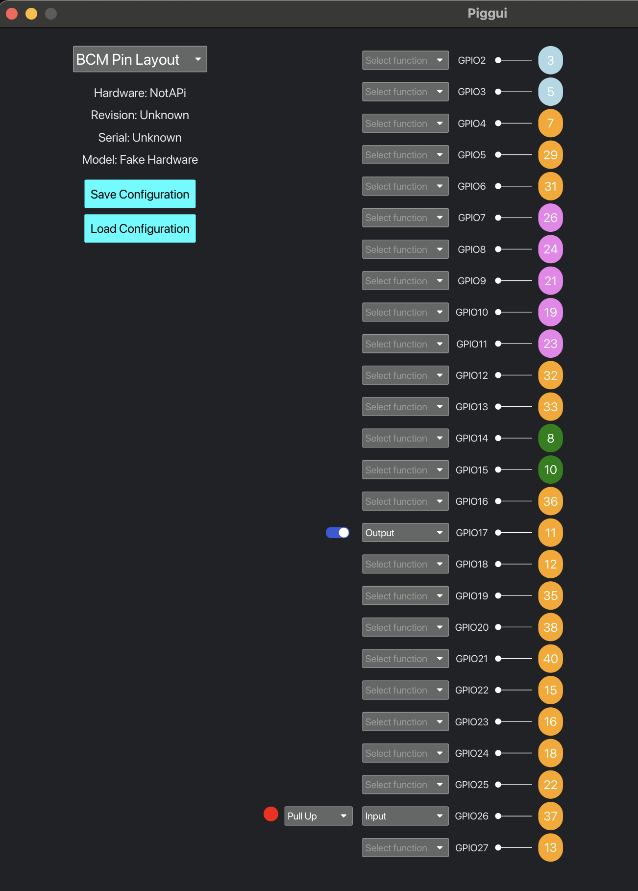
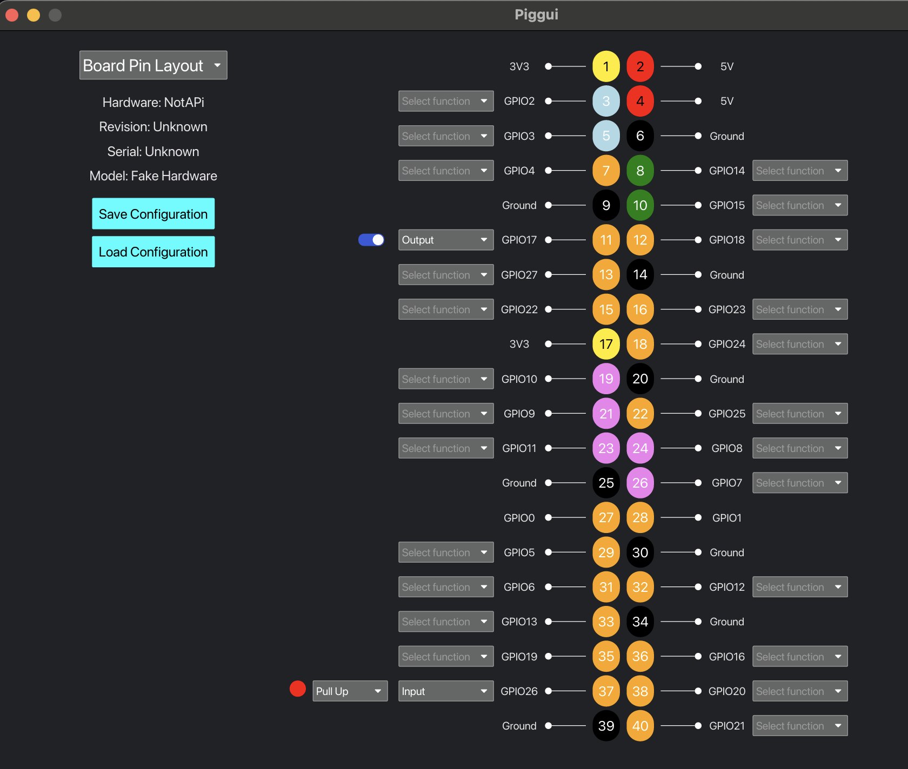

[](https://codecov.io/gh/andrewdavidmackenzie/pigg)

# pigg - Raspberry Pi GPIO GUI

A GUI for visualization/control of GPIO on Raspberry Pis, written in [rust](https://www.rust-lang.org/)
using [Iced](https://github.com/iced-rs/iced) for the
GUI and [rppal](https://github.com/golemparts/rppal) for Raspberry Pi GPIO control.

The GUI component, the Pi Gpio GUI (PIGGUI) is affectionately known as "piggy".

<table cellspacing="0" cellpadding="0">
  <tr>
    <td valign="top">
      
    </td>
    <td valign="top">
      
    </td>
  </tr>
</table>

This first versions allows you to set up a GPIO hardware with Inputs or Outputs, and to control the
level of the outputs and see the level of the inputs, from the GUI.

We have many ideas for how to improve it though, so please read on and send us your ideas also!

## Motivation

We started this project mainly to continue our learnings in rust, Iced-based GUIs and Raspberry
Pi GPIO Hardware control.

So, it's possible you might think "I can already this with 'XYZ'", but we wanted to do a native GUI in rust
around the Pi and GPIO.

Please let us know what you think, and suggestions, via GitHub discussions or GH issues, or in threads where we
communicate its existence (discord, reddit, etc.).

## Current Functionality

- visual representation of the GPIO pins in two layouts, a "Board Pin Layout" that mimics the
  physical layout of the Pi's GPIO connector/header, or a "BCM Pin Layout" with only the programmable
  GPIO pins, ordered by BCM pin number
- Each pin has its board pin number, name and function.
- Drop down selector to config each pin (Currently as an Input with or without pull-up/pull-down, or
  as an Output)
- Inputs have a visualization like an LED to show its current level (Black is unknown, Red is off, Green is on)
- Outputs have a toggle switch that can be used to change the value at the output
- GPIO configurations can be loaded at startup with a command line filename option, or loaded via
  file-picker from the UI or saves to file via file picker.

## Help wanted, Raspberry Pi experts!

We would like help and/or input from Raspberry Pi users in the following areas:

- Pin definitions and their alternative functions. We have done an initial definition for GPIO (Input/Output)
  functionality, gathering data from multiple sources, but we have found a number of contradictions in pin
  definitions that we need to get to the bottom of before we extend the functionality further. The problems
  detected can be found described in detail
  in [GitHub issue #102](https://github.com/andrewdavidmackenzie/pigg/issues/102)
- Deciding the order of things to work on in the future based on interest from others.
- Ideas for how to integrate newer functionalities (e.g. I2C buses, SPI, UART, etc.)

## Short-term Roadmap

We have identified a number of areas we would like to work on after this initial release,
but would really appreciate your input on what could be most useful or just the coolest,
many have GH issues.

- Review pin descriptions [Issue #102](https://github.com/andrewdavidmackenzie/pigg/issues/102)
- Code cleanup and refactor [Issue #101](https://github.com/andrewdavidmackenzie/pigg/issues/101)
- Add tests for UI and get coverage up [Issue #19](https://github.com/andrewdavidmackenzie/pigg/issues/19)
- Better error handling [Issue #89](https://github.com/andrewdavidmackenzie/pigg/issues/89)
- Automation of release process and publishing
  packages [Issue #85](https://github.com/andrewdavidmackenzie/pigg/issues/85)
- Improvements to Load/Save functionality [Issue #103](https://github.com/andrewdavidmackenzie/pigg/issues/103)
- Pre-built binaries for install on Raspberry Pi [Issue #112](https://github.com/andrewdavidmackenzie/pigg/issues/112)
  and easier install [Issue #111](https://github.com/andrewdavidmackenzie/pigg/issues/111)
- Improve visualizations of inputs [Issue #116](https://github.com/andrewdavidmackenzie/pigg/issues/116)
- Expand support beyond GPIO ( e.g. Clocks, PWM, I2C, UART, SPI etc.) with GUI support for config of pins in groups
  Issues [#53](https://github.com/andrewdavidmackenzie/pigg/issues/53),
  [#52](https://github.com/andrewdavidmackenzie/pigg/issues/52), [#5](https://github.com/andrewdavidmackenzie/pigg/issues/5)
- True logical layout, grouping pins by function [Issue #94](https://github.com/andrewdavidmackenzie/pigg/issues/94)

## Further out ideas

- Allow connections between pins [Issue #95](https://github.com/andrewdavidmackenzie/pigg/issues/95)
- Able to have UI on different device to where GPIO is and connect
  remotely
  Issues [#106](https://github.com/andrewdavidmackenzie/pigg/issues/106),
  [#3](https://github.com/andrewdavidmackenzie/pigg/issues/3)
- Pico support for a headless hardware backend
- Trigger a script or WebAssembly plugin on an input event (edge, level, etc.)

## Project Structure

### PIGGUI ("Piggy")

A binary that shows a GUI for configuring pins, observing input levels and controlling output
levels.
On Raspberry Pi it has a real GPIO hardware backend (via rppal).
On macOS and linux it uses a fake GPIO hardware backend.

### PIGLET ("Piglet) - TODO

A headless binary that is only built on RaspberryPi and that has no UI.

## Installing

Use

```
cargo install pigg
```

to build and install.

NOTE: `cargo` will build it for the machine where you are running it, so if you run it on Mac or Linux,
you will get a version of `piggui` with fake hardware backing it, not real Pi GPIO hardware.

To be able to interact with real Pi GPIO hardware you have two options:

- Run `cargo install --features "gui","pi"` on your Pi
- Follow the instructions before for Building from Source
  - Directly on your Raspberry Pi.
  - Use `make` to build on your machine for your Pi, but you will need `Docker`/`Podman` and `cross`
    installed

Soon, we will add support for `cargo binstall` to allow you to get a binary

## Building from Source

### Pre-requisites

We use `"cross"` to cross compile for Raspberry Pi from Linux or macOS.
Install docker or podman and `"cross"` for cross compiling rust on your host for the Raspberry Pi.

If you run `"make"` on a Raspberry Pi, it will not use `"cross"` and just compile natively.
So, to be clear `"cross"` is not a pre-requisite for Raspberry Pi native building.

### Building on host development machine

Run `"make"` on macOS or linux (or in fact RPi also) host to build these binaries:

- `target/debug/piggui` - GUI version without GPIO, to enable UI development on a host
- `target/aarch64-unknown-linux-gnu/release/piggui` - GUI version for Pi with GPIO, can be run natively from RPi command
  line
- `target/aarch64-unknown-linux-gnu/release/piglet` - Headless version for Pi with GPIO, can be run natively from RPi
  command line

Use `"make run"` to start `piggui` on the local machine - for GUI development.

### Building for Pi from macOS or Linux

If you use `make` that builds for local host AND pi (using cross).

#### Helper Env vars

There are a couple of env vars that can be setup to help you interact with your pi.

You can set these up in your env, so you always have them, or set them on the command line when invoking `make`

- `PI_TARGET` Which Pi to copy files to and ssh into
  `PI_TARGET := pizero2w0.local`

- `PI_USER` The username of your user on the pi, to be able to copy files and ssh into it
  `PI_USER := andrew`

#### Make targets

- Use `make` to run `clippy`, build for the Pi using `cross`, build for the local machine using `cargo` and to run tests
- Use `make pibuild` to build only for the Pi. This will build both `piggui` (with GUI and GPIO) and `piglet` binary
  with GPIO only
- Use `make copy` to copy the built binaries to your raspberry pi.
- Use `make ssh` to ssh into your Pi to be able to run the binaries.

### Building for Pi on a Pi!

You should be able to use `make` or `make run` directly, and it will build `piggui` with a GUI and
also build `piglet`

## Running

### Piggui

Use `make run`

One Mac/Linus this will build for the local machine, and start `piggui` with a fake hardware backend.

If you run that on a Raspberry Pi, it will detect that, and build for the Pi, with the real Pi GPIO hardware backend.

Piggui takes an optional filename argument, to attempt to load the code from. If there is an error
loading a config, the default config will be used.

To do this you can use the equivalent of what `make run` does, adding the filename:

- On a Pi: `cargo run --features "pi","gui" -- <filename>`
- On macOS and Linux: `cargo run --features "gui"  -- <filename>`

## Contributing

See [CONTRIBUTING.md](CONTRIBUTING.md)

## License

See [LICENSE](LICENSE)

## Code of Conduct

See [CODE_OF_CONDUCT.md](CODE_OF_CONDUCT.md)

## Security

See [SECURITY.md](SECURITY.md)
