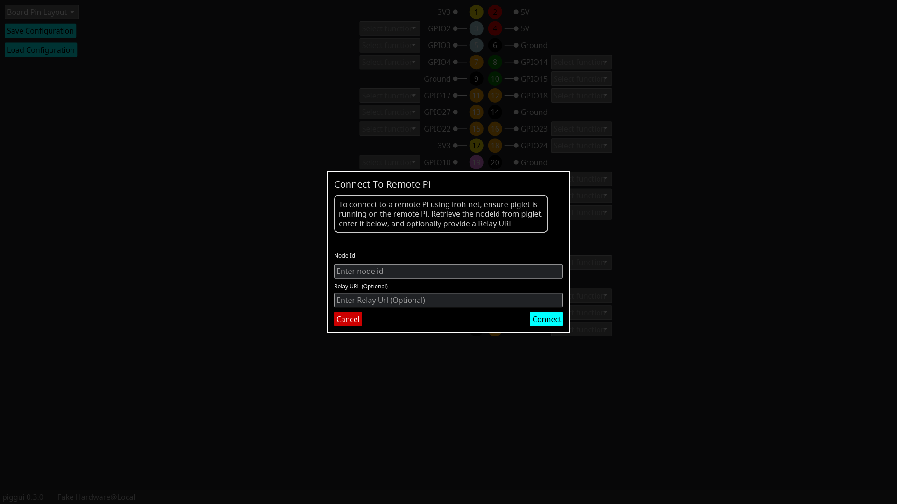

# pigg - Raspberry Pi GPIO GUI

An app for Raspberry Pi GPIO Output control and Input visualization, built in rust using the
[Iced](https://github.com/iced-rs) GUI toolkit and [rppal](https://github.com/golemparts/rppal/) GPIO crate.

The GUI binary (Pi Gpio GUI - PIGGUI) is affectionately known as "piggy".

<table cellspacing="0" cellpadding="0" border="0">
  <tr>
    <td valign="top">
      
    </td>
    <td valign="top">
      
        
      
    </td>
  </tr>
</table>

Currently, when run on a Pi, you can configure the Pi's GPIO hardware Inputs or Outputs, controlling the
level of the Outputs and view the level of the Inputs.

It runs on macOS/Linux/Windows. When we add networking support, this will allow you to control the Pi GPIO
hardware remotely.

<table cellspacing="0" cellpadding="0" border="0">
  <tr>
    <td valign="top">
      
    </td>
    <td valign="top">
      
    </td>
  </tr>
</table>

## Current Features

- Visual representation of the GPIO pins in two layouts, a "Board Pin Layout" that mimics the
  physical layout of the Pi's GPIO connector/header, or a "BCM Pin Layout" with only the programmable
  GPIO pins, ordered by BCM pin number
- Each pin has its board pin number, name and function.
- Drop down selector to config each pin (Currently as an Input with or without pull-up/pull-down, or
  as an Output)
- Inputs have a visualization like an LED to show its current level (Black is unknown, Red is off, Green is on),
  plus a waveform view that shows you the recent history of the level detected on the input.
- Outputs have a toggle switch that can be used to change the stable value of the output, plus a "clicker" for quick
  inversions of the stable level, plus a waveform view showing the recent history of the level set on the Output.
- GPIO configurations can be loaded at startup with a command line filename option, or loaded via
  file-picker from the UI or saved to file via file picker.
- The GUI (`piggui`) can connect to a Pi over the network (running `piglet`) to control and view the GPIO hardware
  from a distance. The GUI can run on Mac, Linux, Windows or Raspberry Pis.

You can see more gifs and videos of features [here](assets/features.md)

## Input from Raspberry Pi users wanted

We would like input from Raspberry Pi users to help us decide the order of things to work on in the future,
and input on how integrate new functionalities (e.g. I2C buses, SPI, UART, etc.).

Please let us know what you think, and suggestions, via
[Discussions](https://github.com/andrewdavidmackenzie/pigg/discussions) or GH issues.

## Short-term Roadmap

We have identified a number of areas we would like to work on after this initial release,
but would really appreciate your input on what could be most useful or just the coolest,
many have GH issues.

- Automation of release process and publishing
  packages [Issue #85](https://github.com/andrewdavidmackenzie/pigg/issues/85)
- Pre-built binaries for install on Raspberry Pi [Issue #112](https://github.com/andrewdavidmackenzie/pigg/issues/112)
  and easier install [Issue #111](https://github.com/andrewdavidmackenzie/pigg/issues/111)
- Expand support beyond Inputs and Outputs ( e.g. Clocks, PWM, I2C, UART, SPI etc.).
  Issue [#53](https://github.com/andrewdavidmackenzie/pigg/issues/53),
  [#52](https://github.com/andrewdavidmackenzie/pigg/issues/52), [#5](https://github.com/andrewdavidmackenzie/pigg/issues/5)
- True logical layout, grouping pins by function [Issue #94](https://github.com/andrewdavidmackenzie/pigg/issues/94)

## Further out ideas

- Allow connections between pins [Issue #95](https://github.com/andrewdavidmackenzie/pigg/issues/95)
- Pico support for a headless hardware backend accessed over the network
- Trigger a script or WebAssembly plugin on an input event (edge, level, etc.)

## Project Structure

### PIGGUI ("Piggy")

A binary that shows a GUI for configuring pins, observing input levels and controlling output
levels.
On Raspberry Pi it has a real GPIO hardware backend (via rppal).
On macOS, linux and windows it uses a fake GPIO hardware backend.

### PIGLET ("Piglet)

A "GUI-less" binary. Currently, it has minimal functionality. It can be built on any platform and will use the fake
Hardware backend (but not be very useful!).

If built on the Pi (with the "pi_hw" feature), then it has a real GPIO hardware backend.

It takes a file command line option. It will load the GPIO configuration from the file (like "piggui" can) and
it will apply it to the hardware. But currently there is no way to interact with it after that.

## Installing

Until we complete some work to produce pre-built binaries for supported platforms, and ways to install them
directly, to install `piggui` and `piglet` you will have to build and install them from source.
See the section on that below for details.

This is an area where we welcome ideas, input and contributions - please post your thoughts to the
[Discussions](https://github.com/andrewdavidmackenzie/pigg/discussions)

## Building Piggui and Piglet from Source

See [BUILDING.md](BUILDING.md)

## Running Piggui and Piglet

For details on running `piglet` and `piggui` in the foreground or as a system service, on the same machine or with a
remote GUI to Pi hardware, see [RUNNING.md](RUNNING.md)

## Contributing

See [CONTRIBUTING.md](CONTRIBUTING.md)

## License

See [LICENSE](LICENSE)

## Code of Conduct

See [CODE_OF_CONDUCT.md](CODE_OF_CONDUCT.md)

## Security

See [SECURITY.md](SECURITY.md)
