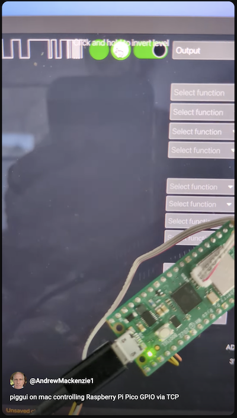

# Feature Showcase

Here are some gifs and links to YouTube videos showing some of the features.

[Unsaved Changes](https://youtu.be/fsVEEGDk_uo)

[Switching Layouts](https://youtu.be/E7nFj1xue9Y)

[Save on Exit](https://youtu.be/Iskqz4hG1e8)

[Output](https://youtu.be/lNTO16wVHH8)

[Input (fake hardware)](https://youtu.be/7wKP8AUwhq0)

[Hardware Details](https://youtu.be/__XOwXazERw)

[File Saved](https://youtu.be/EA5txayqH3I)

[Version details](https://youtu.be/KjPX6tWX9Cs)

## Videos

## Displaying an Inputs level from HW Button

## Controlling an LED on an Output

## Remote GPIO from piggui to piglet using Command Line option

## Remote GPIO from piggui to piglet using Connect Dialog

## Piggui controlling a Pi Pico with porky

