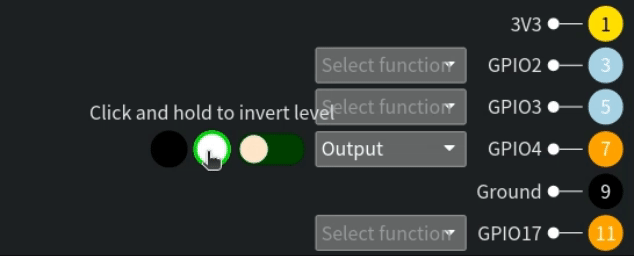

# piggui - Raspberry Pi GPIO GUI

`piggui` is a GUI for configuring pins, observing input levels and controlling output levels.
On Raspberry Pi it has a real GPIO hardware backend (via rppal).
On macOS, Linux and Windows it can connect to a remote hardware backend that is running `pigglet`.

<table cellspacing="0" cellpadding="0" border="0">
  <tr>
    <td valign="top">
      
    </td>
    <td valign="top">
      
        
      
    </td>
  </tr>
</table>

<table cellspacing="0" cellpadding="0" border="0">
  <tr>
    <td valign="top">
      
    </td>
    <td valign="top">
      
    </td>
  </tr>
</table>
(some images/gifs/videos maybe slightly out of date as the GUI evolves...)

See what's new in [latest release](https://github.com/andrewdavidmackenzie/pigg/releases/latest)

[Website](https://mackenzie-serres.net/pigg/)

## Details

- Can run directly on a Pi or remotely from other platforms to allow you to configure the GPIO hardware Inputs and
  Outputs, controlling the level of the Outputs and view the level of the Inputs in the GUI.
- Pre-built images for different OS and CPU architecture, along with installers. See [INSTALLING.md](../INSTALLING.md)
  for
  details.
- Visual representation of the GPIO pins in two layouts, a "Board Pin Layout" that mimics the
  physical layout of the Pi's GPIO connector/header, or a "BCM Pin Layout" with only the programmable
  GPIO pins, ordered by BCM pin number. Physical pin layout adapts to reflect the device that `piggui` is connected
  to as Pi and Pi Pico pin outs are different.
- Each pin has its board pin number, name and function.
- Drop down selector to config each pin (Currently as an Input with or without pull-up/pull-down, or
  as an Output)
- Inputs have a visualization like an LED to show its current level (Black is unknown, Red is off, Green is on),
  plus a waveform view that shows you the recent history of the level detected on the input.
- Outputs have a toggle switch that can be used to change the stable value of the output, plus a "clicker" for quick
  inversions of the stable level, plus a waveform view showing the recent history of the level set on the Output.
- GPIO configurations can be loaded at startup with a command line filename option, or loaded via
  file-picker from the UI or saved to file via file picker, or the device will communicate it's current configuration
  to the GUI, allowing you to continue with the configuration currently being used by the GPIO hardware.
- GUI discovery of devices using mDNS for networked `pigglet`s and `porky`s, or USB for direct connected `porky`s.
- The GUI (`piggui`) can connect to a Pi (running `pigglet`) over the network, or to a Pi Pico/Pi Pico W (over the
  network or USB direct connect) to control and view the GPIO hardware from a distance.
- The GUI can run on Mac, Linux, Windows or Raspberry Pis. Events are timestamped at source (as close to the hardware
  as possible) so network delays should not affect the waveforms displayed. Please provide us feedback and ideas related
  to networking in Discussions or GH issues.
- The data required to connect to a remote node via iroh-net is called the `nodeid`. `pigglet` prints this out for you
  if it is started in the foreground. When `pigglet` has been started as a system service, start another instance in the
  foreground and this will detect the background instance and display its `nodeid` for you then exit.
- Take the `nodeid` and either supply it as a command line option to `piggui` (`--nodeid $nodeid`, prefixed with `-- `
  if using `cargo run`) or enter it into the GUI. To connect to a remote instance from the GUI, click on the
  "hardware menu" in the left of the info bar at the bottom of the screen and select the "Connect to remote Pi..."
  menu item. Then enter the `nodeid` into the field provided and hit "Connect"
- Here are two videos showing the two ways to use it, with pigglet running on a RPi shown via VNC.
    - Video with Dialog: https://youtu.be/aToJ1aT7NeM
    - Video using CLI argument: https://youtu.be/zcEa_Oke014

You can see more gifs and videos of features [here](../assets/features.md)

## Pigglet

`pigglet` is a "headless" command line utility that interacts with the GPIO hardware, and can either apply a
config supplied from file and stop, or can listen for config changes from a remote `piggui` and report input
level changes to the GUI.

For more details see [pigglet's README.md](../pigglet/)

## Porky

`porky` is an embedded application developer for the Raspberry Pi Pico and Pi Pico W for remote interaction with the
Pico's GPIO hardware. It can be connected to over TCP or USB.

For more details see [porky's README.md](../porky/)

## Supported Hardware and Operating Systems

`pigg` has a number of binaries as part of the project (see descriptions above) and they are tested in CI, or
manually or are known to work as follows:

| Application | Arch Supported | Device    | OS Supported       | Asset                                                                                                                                                             |
|-------------|----------------|-----------|--------------------|-------------------------------------------------------------------------------------------------------------------------------------------------------------------|
| piggui      | Apple Silicon  |           | macOS 15           | [piggui-aarch64-apple-darwin.tar.xz](https://github.com/andrewdavidmackenzie/pigg/releases/download/0.7.2/piggui-aarch64-apple-darwin.tar.xz)                     |
|             | x86_64         |           | macOS 15           | [piggui-x86_64-apple-darwin.tar.xz](https://github.com/andrewdavidmackenzie/pigg/releases/download/0.7.2/piggui-x86_64-apple-darwin.tar.xz)                       |
|             | x86_64         |           | Ubuntu 24.04       | [piggui-x86_64-unknown-linux-gnu.tar.xz](https://github.com/andrewdavidmackenzie/pigg/releases/download/0.7.2/piggui-x86_64-unknown-linux-gnu.tar.xz)             |
|             | x86_64         |           | Windows 10         | [piggui-x86_64-pc-windows-msvc.msi](https://github.com/andrewdavidmackenzie/pigg/releases/download/0.7.2/piggui-x86_64-pc-windows-msvc.msi)                       |
|             | aarch64        | Pi400     | Pi OS              | [piggui-aarch64-unknown-linux-gnu.tar.xz](https://github.com/andrewdavidmackenzie/pigg/releases/download/0.7.2/piggui-aarch64-unknown-linux-gnu.tar.xz)           |
|             | aarch64        | Pi4       | Pi OS              | [piggui-aarch64-unknown-linux-gnu.tar.xz](https://github.com/andrewdavidmackenzie/pigg/releases/download/0.7.2/piggui-aarch64-unknown-linux-gnu.tar.xz)           |
|             | aarch64        | Pi5       | Pi OS              | [piggui-aarch64-unknown-linux-gnu.tar.xz](https://github.com/andrewdavidmackenzie/pigg/releases/download/0.7.2/piggui-aarch64-unknown-linux-gnu.tar.xz)           |
|             | arm            | Pi Zero   | Pi OS (32bit)      | [piggui-arm-unknown-linux-gnu.tar.xz](https://github.com/andrewdavidmackenzie/pigg/releases/download/0.7.2/piggui-arm-unknown-linux-gnu.tar.xz)                   |
|             | aarch64        | Pi Zero 2 | Pi OS (64bit)      | [piggui-aarch64-unknown-linux-gnu.tar.xz](https://github.com/andrewdavidmackenzie/pigg/releases/download/0.7.2/piggui-aarch64-unknown-linux-gnu.tar.xz)           |
|             | armv7 musl     | Pi3B      | Ubuntu 18.04.6 LTS | [piggui-armv7-unknown-linux-musleabihf.tar.xz](https://github.com/andrewdavidmackenzie/pigg/releases/download/0.7.2/piggui-armv7-unknown-linux-musleabihf.tar.xz) |
|             | armv7 gnu      | Pi3B      | Ubuntu 18.04.6 LTS | [piggui-armv7-unknown-linux-gnueabihf.tar.xz](https://github.com/andrewdavidmackenzie/pigg/releases/download/0.7.2/piggui-armv7-unknown-linux-gnueabihf.tar.xz)   |

## Installing

See [INSTALLING.md](../INSTALLING.md)

## Help

See [HELP.md](../HELP.md) for help with known issues. We hope to grow this and maybe link with the GUI and reported
errors.

## Building from Source

See [BUILDING.md](../BUILDING.md)

## Running Piggui and Pigglet

For details on running `piggui` see [RUNNING.md](../RUNNING.md)

## Contributing

See [CONTRIBUTING.md](../CONTRIBUTING.md)

## License

See [LICENSE](../LICENSE)

## Code of Conduct

See [CODE_OF_CONDUCT.md](../CODE_OF_CONDUCT.md)

## Security

See [SECURITY.md](../SECURITY.md)
